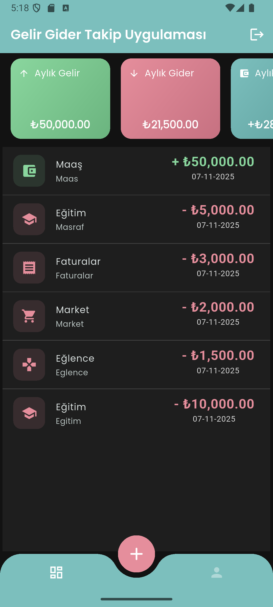

# 📊 Gelir Gider Takip Uygulaması

Flutter ile geliştirilmiş, kişisel finans yönetimini kolaylaştıran bir mobil uygulama.  
Gelir ve giderlerinizi kaydedebilir, aylık özetleri görüntüleyebilir ve Google hesabınızla giriş yapabilirsiniz.

---

## 🚀 Özellikler

- ✅ Gelir ve giderlerinizi kategori bazlı kaydedin
- 📅 Aylık özet ve toplam bakiye görüntüleyin
- 🔐 Google Sign-In ile güvenli giriş
- 🎨 Google Fonts ile modern tipografi
- 🧭 Animasyonlu alt navigasyon çubuğu
- 🌍 Intl paketi ile tarih ve sayı formatlama desteği

---

## 📦 Kullanılan Paketler

```yaml
get: ^4.7.2
shared_preferences: ^2.5.3
dio: ^5.9.0
google_sign_in: ^6.3.0
google_fonts: ^6.3.2
animated_bottom_navigation_bar: ^1.4.0
intl: ^0.20.2
flutter_dotenv: ^6.0.0
```

## 📸 Ekran Görüntüsü



📂 Proje Yapısı

```text
lib/
├── core/                # Uygulama çekirdek yapısı (config, constants, helpers)
├── models/              # Veri modelleri (ör. User, Transaction)
├── modules/             # Özelleştirilmiş modüller (gelir, gider, dashboard)
├── repositories/        # Veri erişim katmanı (API, local storage)
├── routes/              # Uygulama rotaları ve navigation
├── services/            # Servisler (auth, network, notification)
├── themes/              # Tema ve stil dosyaları
├── utils/               # Yardımcı fonksiyonlar, formatlayıcılar

```

🚀 Kurulum

# Repoyu klonla

```bash
git clone https://github.com/rafettcelikk/Flutter-Budget-Tracker-App.git

```

# Proje klasörüne gir

```bash
cd flutter_budget_tracker_app

```

# Bağımlılıkları yükle

```bash
flutter pub get

```

# Uygulamayı çalıştır

```bash
flutter run

```
